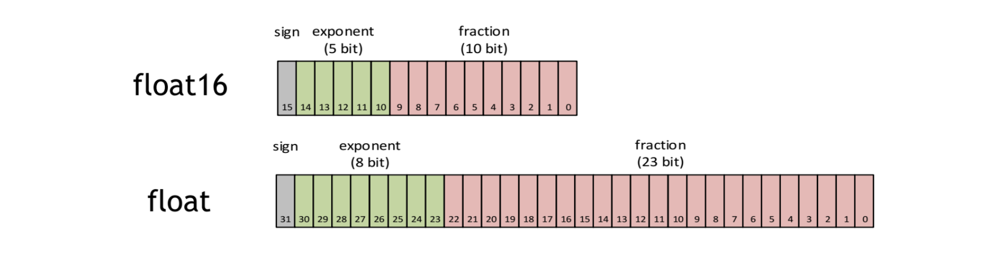
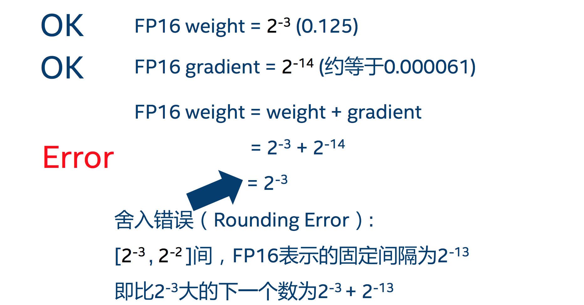
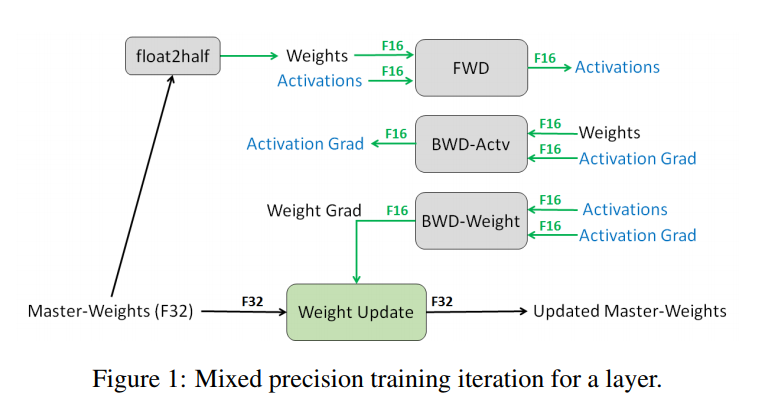
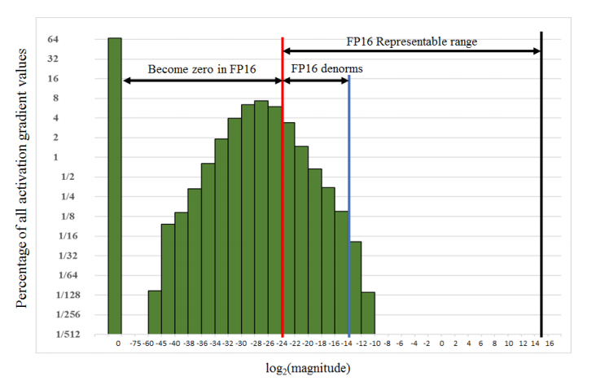

## 使用Pytorch实现半精度训练和混合精度训练


<center>图片来源于https://mp.weixin.qq.com/s?__biz=MzU2NzkyMzUxMw==&mid=2247490135&idx=2&sn=af5a8dc23412db33ce6ca8f3d92f326a&source=41#wechat_redirect</center>

### Pytorch中的AMP
AMP：是Automatic mixed precision、自动混合精度的意思。在神经网络推理过程中，可以针对不同的层，选取不同的数据精度来进行计算，从而实现节省显卡资源和加快速度。这里所说的不同数据精度，其实就是将FP32单精度和FP16半精度结合在一起，并使用相同的超参数来实现与FP32差不多相同的精度。

在Pytorch1.5以及之前的版本中，是通过NVIDIA提供的apex库来实现amp的功能，但在使用的过程中存在版本兼容的问题。从Pytorch1.6开始，就将AMP集成进了torch.cuda中，支持自动混合精度训练，并且兼容性做得也是比较好，使用AMP后，最多可以节省一般的显存资源。

在使用之前，首先需要判断你的GPU是否支持FP16。



<center>图片来源于https://blog.csdn.net/junbaba_/article/details/119078807</center>

所谓AMP，关键是自动以及混合精度。

自动：张量的类型会自动变化。框架会根据情况自动调整张量的类型，但是个别地方可能还是需要人为修改。

混合精度：采用不同精度的张量，一般是FP32和FP16这两种精度。

一般来说，大多数深度学习框架如TensorFlow、Pytorch都是采用32位的浮点数来进行训练。与FP32相比，FP16的内存消耗仅为FP32的一半，因此FP16更加适合在移动端侧上进行AI计算。相比FP32来说，占用内存减少了一半，同时也有相应的指令值，所以速度比FP32要快许多。FP16更适合在精度要求不高的场景中。

- FP32指数占8位，尾数占23位，数据的动态范围是[2^-126, 2^127]，是深度学习框架训练时常用的数据类型。
- FP16指数占5位，尾数占10位，相比FP32，FP16的表示范围更窄，最小可表示的正数数值为2^-14，最大可表示的数据为65504，容易出现数值溢出。


### 为什么要使用AMP?

因为在一些情况下使用FP32有优势，而在另外的一些情况下，FP16有优势。

在PyTorch 1.6的AMP上下文中，如下操作中的Tensor会自动转化为半精度浮点型的格式：

```
__matmul__
addbmm
addmm
addmv
addr
baddbmm
bmm
chain_matmul
conv1d
conv2d
conv3d
conv_transpose1d
conv_transpose2d
conv_transpose3d
linear
matmul
mm
mv
prelu
```


### FP16的优势

1. 减少显存占用；

2. 加速训练和推断的计算，相当于可以提速一倍；

3. 更好的利用CUDA设备上的Tensor Core；

### FP16潜在的问题

其实FP16代替FP32造成最大的问题就是精度损失，其中又分为溢出错误和舍入误差。

1. 溢出错误。因为FP16的范围比FP32要窄，表达范围比它要小，所以在计算过程中很容易出现溢出错误。其中又分为上溢出和下溢出，溢出之后就会在计算中出现"NaN"。在训练时，由于激活函数的梯度比较小，往往小于权重的梯度，所以更加容易落入表达范围外的情况，也就是出现下溢出。


<center>图片来源于https://blog.csdn.net/junbaba_/article/details/119078807</center>

2. 舍入误差。舍入误差指的是当梯度过小时，即小于当前区间的最小间隔时，这个数值就会被舍弃，那么会导致这次梯度的更新失败。



<center>图片来源于https://blog.csdn.net/junbaba_/article/details/119078807</center>

​		如果浮点数越小，那么引入的舍入误差就会越大。那么对足够小的浮点数执行任何操作都会将该值进行四舍五入，从而到0。因为在反向传播时，大多数的梯度更新值都是十分微小的，这些舍入误差累积可能会把这一些值都置零或者变为NaN，从而导致不准确的梯度更新或者梯度更新失败。此外，对于FP16来说，有些参数过小的话的话，也会被置为零。


### 以上问题的解决办法

1. 混合精度训练

在训练的FP16矩阵乘法运算中，需要使用FP32来进行矩阵乘法中间的累加计算，然后写入内存时再将FP32的值转化为FP16格式进行存储。即在内存中使用FP16做储存和乘法运算来实现加速，而用FP32进行累加来避免舍入误差。这里主要是认为加法运算主要受限于内存带宽，所以使用混合精度训练既可以避免拖慢速度又可以有效缓解了舍入误差的问题。


2. loss放大

即便使用混合精度进行训练，但是可能还是存在无法收敛的情况，因为在训练的后期，激活梯度的值太小，仍会造成下溢出，也就是接近零的数会下溢成零。所以可以通过放大loss来防止梯度的下溢出。注意这里只在梯度回传的时候放大，当实际需要更新权重时，还是会把放大的梯度再缩放回来。

反向传播前，将loss变化手动放大2^k倍，因此在反向传播时，所获取的激活函数梯度不会发生溢出；

反向传播后，将权重梯度缩小回2^k倍，恢复真实值。

### AMP的工作流程

1. 将输入转为FP16；
2. 进行前向计算，并且在这里使用FP32格式来初始化权重，训练时将FP32的权重转化为FP16来进行前向计算；
3. 计算损失，因为在计算损失过程中，有许多exp，log的计算，可能会造成FP16的溢出，所以这里的loss需要在FP32下进行计算；
4. loss scale：将计算出来的loss乘以一个系数 scaled_loss = loss * loss_scale，经过scaled过后的梯度就会平移到FP16的有效范围中；
5. 反向传播；
6. 梯度计算完后，会将放各梯度乘上相应的缩小的倍数，恢复成原来的大小；
7. 梯度约束，在累许多FP16的数值后，容易发生溢出，所以会在FP32格式下进行约束；
8. 参数更新，根据梯度是否发生溢出来选择是否进行参数的更新并动态调整loss_scale，如果需要更新，就恢复为FP32格式，并在FP32格式的参数上进行更新，否则继续累加，直至需要更新。

### AMP的具体使用

在通过torch.cuda.amp使用AMP，主要是使用autocast、GradScaler这两个类。

#### autocast

使用autocast用于创建AMP上下文环境，在进入autocast的上下文之后，会自动将张量的数据类型转为半精度浮点型，不需要手动调用.half()函数，代码会自动判断哪些层可以转换FP16，而哪些层不可以。

不过，autocast的上下文只包含网络的前向推理过程以及loss的计算，并不包含反向传播，因为反向传播的op会使用和前向推理op一样的类型。


```python
from torch.cuda.amp import autocast as autocast

model=Net().cuda()
optimizer=optim.SGD(model.parameters(),...)

for input,target in data:
  optimizer.zero_grad()

  with autocast():
    output=model(input)
    loss = loss_fn(output,target)

  loss.backward()
  optimizer.step()
```

#### FP32权重备份

这个主要是为了解决舍入误差。在训练过程中会有weights, activations, gradients这几种数据，这些数据在训练时会以FP16格式进行保存，同时复制一份FP32的weights，用于后面的更新。也就是说，梯度更新使用FP16计算，但是是更新在FP32上，这使得应用梯度更新更加安全。



<center>图片来源于https://www.cnblogs.com/shona/p/12674011.html</center>

这主要是因为，在更新权重时，权重 = 旧权重 + lr * 梯度，而lr * 梯度这个值一般来说是非常小的，如果再使用FP16进行相加的话，就很可能会出现舍入误差，导致更新无效。

虽然额外拷贝的FP32格式的weight会增加训练时候显存的占用。但是在实际使用中，占绝大部分的还是activations的值，而不是weights。所以，只要使用FP16来保存activation，那么最终FP16的模型大小和FP32的模型相比，显存占用基本能减半。



<center>图片来源于https://www.cnblogs.com/shona/p/12674011.html</center>


#### GradScaler

在开始训练之前，需要实例化一个GradScaler对象。

scaler的大小会在每次迭代中进行动态估计，为了尽可能减少梯度的下溢出，scaler应该尽可能大；但是如果太大，那么FP16又容易发生上溢出，从而变成inf或NaN。在每次scaler.step(optimizer)中，都会检查是否有inf或NaN的梯度出现，从而实现在不出现inf或NaN的情况下，尽可能的增大scaler。

1. 如果出现inf或NaN，scaler.step(optimizer)会忽略这次权重的更新(optimizer.step())，并且将scaler的大小进行缩小，即乘上backoff_factor；

2. 如果没有出现inf或NaN，那么会正常更新本次权重，并且当持续growth_interval次后都没有出现inf或NaN，那么scaler.update()会将scaler的大小乘以growth_factor。


```python
from torch.cuda.amp import autocast as autocast

model=Net().cuda()
optimizer=optim.SGD(model.parameters(),...)

scaler = GradScaler() # 训练前先实例化出一个GradScaler对象

for epoch in epochs:
  for input,target in data:
    optimizer.zero_grad()	# 正常更新权重

    with autocast():　# 开启autocast上下文，在autocast上下文范围内，进行模型的前向推理和loss计算
      output=model(input)
      loss = loss_fn(output,targt)

    scaler.scale(loss).backward()  # 对loss进行放大，针对放大后的loss进行反向传播
    scaler.step(optimizer)	# 在这里，首先会把梯度值缩放回来，如果缩放后的梯度不是inf或NaN，那么就会调用optimizer.step()来更新权重，否则，忽略step调用，从而保证权重不更新。
    scaler.update()  # 看是否要增大scaler，更新scalar的缩放信息

```

训练完一个batch后，不马上使用所获取到的梯度来更新模型，而是继续训练下一个batch的数据，当完成多次循环后累计到一定次数，用这些累加的梯度来更新参数，这样可以可以起到变相扩大batch_size的作用。

### 参考链接

https://blog.csdn.net/junbaba_/article/details/119078807

https://www.cnblogs.com/shona/p/12674011.html

https://mp.weixin.qq.com/s?__biz=MzU2NzkyMzUxMw==&mid=2247490135&idx=2&sn=af5a8dc23412db33ce6ca8f3d92f326a&source=41#wechat_redirect

https://www.paddlepaddle.org.cn/documentation/docs/zh/guides/performance_improving/amp_cn.html

https://www.paddlepaddle.org.cn/documentation/docs/zh/2.2/guides/01_paddle2.0_introduction/basic_concept/amp_cn.html
