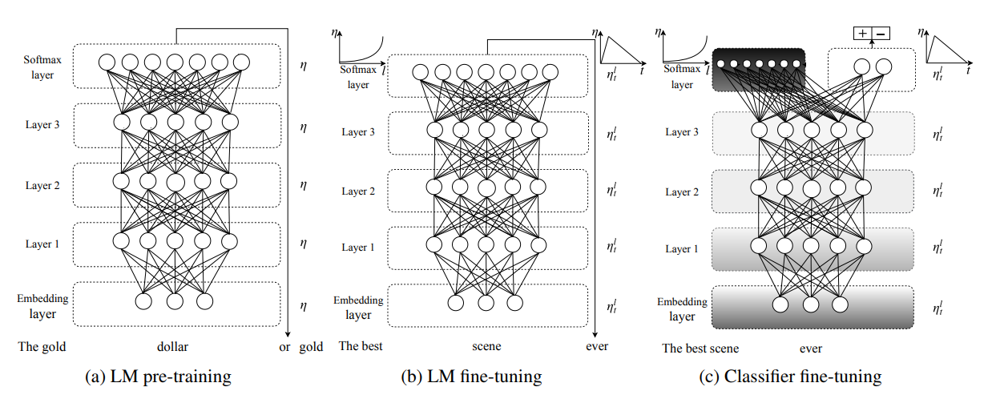

## 前言

在讲关于模型的冻结、微调前，需要引入一个概念，叫迁移学习。迁移学习是指利用旧知识来学习新知识，主要目标是将已经学会的知识很快地迁移到一个新的领域中。

### 迁移学习

当我们训练好了一个模型之后，如果想应用到其他任务中，可以在这个模型的基础上进行训练，来作微调网络。这也是迁移学习的概念，可以节省训练的资源以及训练的时间。

### 模型微调

微调，就是基于一个预训练模型进行训练，比如使用大型数据集ImageNet或者COCO训练好的模型。当然，自己训练好的模型也可以当做预训练模型，然后再在自己的数据集上进行训练，来使模型适用于自己的场景、自己的任务。



为什么要用预训练模型作微调呢？

因为预训练模型用了大量数据做训练，已经具备了提取浅层基础特征和深层抽象特征的能力。


如果数据不够多，泛化性不够强，那么可能存在模型不收敛，准确率低，模型泛化能力差，过拟合等问题，所以这时就需要使用预训练模型来做微调了。

注意的是，进行微调时，应该使用**较小的学习率**。因为预训练模型的权重相对于随机初始化的权重来说已经很不错了，所以不希望使用太大的学习率来破坏原本的权重。

通常用于微调的初始学习率会比从头开始训练的学习率小10倍。

### 需要微调的情况

其中微调的方法又要根据自身数据集和预训练模型数据集的相似程度，以及自己数据集的大小来抉择。

不同情况下的微调：

数据少，数据类似程度高：可以只修改最后几层或者最后一层进行微调。

数据少，数据类似程度低：冻结预训练模型的前几层，训练剩余的层。因为数据集之间的相似度较低，所以根据自身的数据集对较高层进行重新训练会比较有效。

数据多，数据类似程度高：这是最理想的情况。使用预训练的权重来初始化模型，然后重新训练整个模型。这也是最简单的微调方式，因为不涉及修改、冻结模型的层。

数据多，数据类似程度低：微调的效果估计不好，可以考虑直接重新训练整个模型。如果你用的预训练模型的数据集是ImageNet，而你要做的是文字识别，那么预训练模型自然不会起到太大作用，因为它们的场景特征相差太大了。

### 微调的步骤

微调的步骤有很多，看你自身数据和计算资源的情况而定。虽然各有不同，但是总体的流程大同小异。

#### 步骤示例一

1. 在已经训练好的网络上进行修改；
2. 冻结网络的原来那一部分；
3. 训练新添加的部分；
4. 解冻原来网络的部分层；
5. 联合训练解冻的层和新添加的部分。

#### 步骤示例二

1. 在源数据集如ImageNet数据集上预训练一个源模型；
2. 创建一个新的模型，即目标模型。它沿用了源模型上除了输出层外的所有模型结果及其参数；
3. 为目标模型添加一个合适的输出大小，并随机初始化该层的模型参数，或者其它初始化方法； 
4. 在目标数据集上训练目标模型。可以从头训练输出层，而剩下的层都是基于源模型的参数进行微调。

### 参数冻结

我们所提到的冻结模型、冻结部分层，其实归根结底都是对参数进行冻结。冻结训练可以加快训练速度。

在这里，有两种方式：全程冻结与非全程冻结。

非全程冻结比全程冻结多了一个步骤：解冻，因此这里就讲解非全程冻结。看完非全程冻结之后，就明白全程冻结是如何进行的了。

非全程冻结训练分为两个阶段，分别是冻结阶段和解冻阶段。当处于冻结阶段时，被冻结的参数就不会被更新，在这个阶段，可以看做是全程冻结；而处于解冻阶段时，就和普通的训练一样了，所有参数都会被更新。

当进行冻结训练时，占用的显存较小，因为仅对部分网络进行微调。如果计算资源不够，也可以通过冻结训练的方式来减少训练时资源的占用。

### 冻结的方式

我们经常提到的模型，就是一个可遍历的字典。既然是字典，又是可遍历的，那么就有两种方式进行索引：一是通过数字，二是通过名字。

其实使用冻结很简单，没有太高深的魔法，只用设置模型的参数`requires_grad`为False就可以了。

#### 方式一

通过数字来遍历模型中的层的参数，冻结所指定的若干个参数。

```python
count = 0
for layer in model.children():
    count = count + 1
    if count < 10:
        for param in layer.parameters():
            param.requires_grad = False
```

然后将需要训练的参数传入优化器，也就是过滤掉被冻结的参数。

```python
optimizer = torch.optim.Adam(filter(lambda p: p.requires_grad, model.parameters()), lr=LR)
```

#### 方式二

因为ImageNet有1000个类别，所以提供的ImageNet预训练模型也是1000分类。如果我需要训练一个10分类模型，理论上来说只需要修改最后一层的全连接层即可。

如果前面的参数不冻结就表示所有特征提取的层会使用预训练模型的参数来进行参数初始化，而最后一层的参数还是保持某种初始化的方式来进行初始化。

在模型中，每一层的参数前面都有前缀，比如conv1、conv2、fc3、backbone等等，我们可以通过这个前缀来进行判断，也就是通过名字来判断，如：`if "backbone"  in param.name`，最终选择需要冻结与不需要冻结的层。

```python
    if freeze_layers:
        for name, param in model.named_parameters():
            # 除最后的全连接层外，其他权重全部冻结
            if "fc" not in name:
                param.requires_grad_(False)

    pg = [p for p in model.parameters() if p.requires_grad]
    
    optimizer = optim.SGD(pg, lr=0.01, momentum=0.9, weight_decay=4E-5)
```

或者判断该参数位于模型的哪些模块层中，如` param in model.backbone.parameters()`，然后对于该模块层的全部参数进行批量设置，将`requires_grad`置为False。

```python
if Freeze_Train:
    for param in model.backbone.parameters():
        param.requires_grad = False
```

同样，方式二最后也是需要和上面方式一的末尾一样，将训练的参数传入优化器进行配置。

### 修改模型参数

前面说道，冻结模型就是冻结参数，那么这里的修改模型参数更多的是修改模型参数的名称。

值得一提的是，由于训练方式（单卡、多卡训练）、模型定义的方式不同，参数的名称也会有所区别，但是此时模型的结构是一样的，依旧可以加载预训练模型。不过却无法直接载入预训练模型的参数，因为名称不同，会出现KeyError的错误，所以载入前可能需要修改参数的名称。

比如说，使用多卡训练时，保存的时候每个参数前面多会多出'module.'这几个字符，那么当使用单卡载入时，可能就会报错了。


通过以下方式，就可以使用'conv1'来替代'module.conv1'这个key的方式来将更新后的key和原来的value相匹配，再载入自己定义的模型中。

```python
model_dict = pretrained_model.state_dict()

pretrained_dict={k: v for k, v in pretrained_dict.items() if k[7:] in model_dict}
 
model_dict.update(pretrained_dict)
```

### 修改模型结构

修改模型结构会稍微复杂一些，但其实无非就是增删改：给模型增加一个分支、删除模型的某一层，修改模型的输出维度等等。下面就来看看是如何进行模型修改的：

```python
import torch.nn as nn
import torch


class AlexNet(nn.Module):
    def __init__(self):
        super(AlexNet, self).__init__()
        self.features=nn.Sequential(
            nn.Conv2d(3, 64, kernel_size=11, stride=4, padding=2),  # 使用卷积层，输入为3，输出为64，核大小为11，步长为4
            nn.ReLU(inplace=True),  # 使用激活函数
            nn.MaxPool2d(kernel_size=3, stride=2),  # 使用最大池化，这里的大小为3，步长为2
            nn.Conv2d(64, 192, kernel_size=5, padding=2), # 使用卷积层，输入为64，输出为192，核大小为5，步长为2
            nn.ReLU(inplace=True),# 使用激活函数
            nn.MaxPool2d(kernel_size=3, stride=2), # 使用最大池化，这里的大小为3，步长为2
            nn.Conv2d(192, 384, kernel_size=3, padding=1), # 使用卷积层，输入为192，输出为384，核大小为3，步长为1
            nn.ReLU(inplace=True),# 使用激活函数
            nn.Conv2d(384, 256, kernel_size=3, padding=1),# 使用卷积层，输入为384，输出为256，核大小为3，步长为1
            nn.ReLU(inplace=True),# 使用激活函数
            nn.Conv2d(256, 256, kernel_size=3, padding=1),# 使用卷积层，输入为256，输出为256，核大小为3，步长为1
            nn.ReLU(inplace=True),# 使用激活函数
            nn.MaxPool2d(kernel_size=3, stride=2),  # 使用最大池化，这里的大小为3，步长为2
        )
        self.avgpool=nn.AdaptiveAvgPool2d((6, 6))
        self.classifier=nn.Sequential(
            nn.Dropout(),# 使用Dropout来减缓过拟合
            nn.Linear(256 * 6 * 6, 4096),   # 全连接，输出为4096
            nn.ReLU(inplace=True),# 使用激活函数
            nn.Dropout(),# 使用Dropout来减缓过拟合
            nn.Linear(4096, 4096),  # 维度不变，因为后面引入了激活函数，从而引入非线性
            nn.ReLU(inplace=True),  # 使用激活函数
            nn.Linear(4096, 1000),   #ImageNet默认为1000个类别，所以这里进行1000个类别分类
        )
       

    def forward(self, x):
        x=self.features(x)
        x=self.avgpool(x)
        x=torch.flatten(x, 1)
        x=self.classifier(x)
        return x

def alexnet(num_classes, device, pretrained_weights=""):
    net=AlexNet()  # 定义AlexNet
    if pretrained_weights:  # 判断预训练模型路径是否为空，如果不为空则加载
        net.load_state_dict(torch.load(pretrained_weights,map_location=device)) 
    
    num_fc=net.classifier[6].in_features  # 获取输入到全连接层的输入维度信息
    net.classifier[6]=torch.nn.Linear(in_features=num_fc, out_features=num_classes) # 根据数据集的类别数来指定最后输出的out_features数目
    return net

```

在上述代码中，我是先将权重载入全部网络结构中。此时，模型的最后一层大小并不是我想要的，因此我获取了输入到最后一层全连接层之前的维度大小，然后根据数据集的类别数来指定最后输出的out_features数目，以此代替原来的全连接层。

你也可以先定义好具有指定全连接大小的网络结构，然后除了最后一层全连接层之外，全部层都载入预训练模型；你也可以先将权重载入全部网络结构中，然后删掉最后一层全连接层，最后再加入一层指定大小的全连接层。

方法很多，读者朋友们都可以试试。

#### 文末

可以看出，不管是微调还是冻结，甚至是修改网络方法、方式都很多，需要根据自身地情况去调整，去适应。至于哪种方式最好，只有通过具体实践才能领悟；又或许没有最好的方式，只有最适合这种场景的方式。