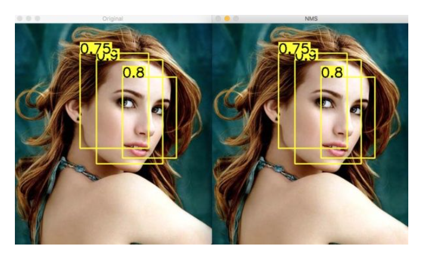
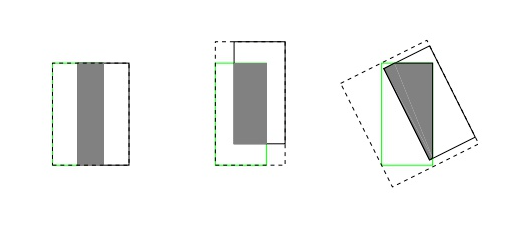
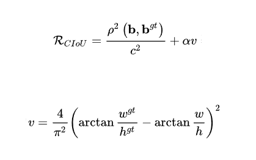

### 前言

当两个预测框十分贴近时，先以具有最高置信度的那个框作为基准，计算两者的IOU重合程度，如果重合度超过阈值，就去掉置信度低的，只保留高的。重复这个过程，直至所有框的重合度低于阈值。在目标检测中，常用NMS来消除冗余的预测框，最终只留下少量的预测框。

### NMS原理

NMS也叫做非极大抑制值。在目标检测网络中，不论one-stage还是two-stage，都会产生许多预测框，它们大多都指向了同一个目标，因此需要通过极大值抑制来筛选掉多余的预测框，来找到每个目标最优的预测框。



NMS的本质是搜索局部极大值，抑制非极大值元素。非极大值抑制，主要就是用来抑制检测时冗余的框。因为在目标检测中，在同一目标的位置上会产生大量的候选框，这些候选框相互之间可能会有重叠，所以我们需要利用非极大值抑制找到最佳的目标边界框，消除冗余的边界框。

### NMS流程

1. 对所有预测框的置信度降序排序；

2. 选出置信度最高的预测框，确认其为正确预测，并计算他与其他预测框的 IOU；

3. 根据步骤2中计算的 IOU 去除重叠度高的，IOU > 阈值就直接删除；

4. 剩下的预测框返回第1步，直到没有剩下的为止。

**一般来说，NMS一次处理只会一个类别，所以如果有N个类别，那么就需要执行N次。**但你也可以只进行一次NMS就处理全部类。

### 代码实现

#### 使用Pytorch自己实现NMS

```python
import torch
import cv2
import numpy as np

def box_area(boxes):

    return (boxes[:, 2] - boxes[:, 0]) * (boxes[:, 3] - boxes[:, 1])


def box_iou(boxes1, boxes2):

    area1 = box_area(boxes1)  # 每个框的面积 (N,)
    area2 = box_area(boxes2)  # (M,)

    lt = torch.max(boxes1[:, None, :2], boxes2[:, :2])  # [N,M,2] # N中一个和M个比较； 所以由N，M 个
    rb = torch.min(boxes1[:, None, 2:], boxes2[:, 2:])  # [N,M,2]

    wh = (rb - lt).clamp(min=0)  # [N,M,2]  #小于0的为0  clamp 钳；夹钳；
    inter = wh[:, :, 0] * wh[:, :, 1]  # [N,M]  

    iou = inter / (area1[:, None] + area2 - inter)
    return iou  # NxM， boxes1中每个框和boxes2中每个框的IoU值；


def ori_nms(boxes, scores, iou_threshold):
    """
    :param boxes: [N, 4]， 此处传进来的框，是经过筛选（NMS之前选取过得分TopK）之后， 在传入之前处理好的；
    :param scores: [N]
    :param iou_threshold: 0.7
    :return:
    """
    keep = []  # 最终保留的结果， 在boxes中对应的索引；
    idxs = scores.argsort()  # 值从小到大的 索引
    while idxs.numel() > 0:  # 循环直到null； numel()： 数组元素个数
        # 得分最大框对应的索引, 以及对应的坐标
        max_score_index = idxs[-1]
        max_score_box = boxes[max_score_index][None, :]  # [1, 4]
        keep.append(max_score_index)
        if idxs.size(0) == 1:  # 就剩余一个框了；
            break
        idxs = idxs[:-1]  # 将得分最大框 从索引中删除； 剩余索引对应的框 和 得分最大框 计算IoU；
        other_boxes = boxes[idxs]  # [?, 4]
        ious = box_iou(max_score_box, other_boxes)  # 一个框和其余框比较 1XM
        idxs = idxs[ious[0] <= iou_threshold]

    keep = idxs.new(keep)  # Tensor
    return keep
```

下面对四个box来进行NMS操作，并通过OpenCV来看这四个box的位置。


```python
img = np.zeros([224, 224, 3], np.uint8)
box1 = [20, 50, 125, 189]
box2 = [34, 55, 110, 201]
box4 = [78, 180, 157, 200]
box3 = [112, 131, 155, 195]

cv2.rectangle(img, (box1[0], box1[2]), (box1[1], box1[3]), (0, 255, 0), 2)
cv2.rectangle(img, (box2[0], box2[2]), (box2[1], box2[3]), (0, 255, 0), 2)
cv2.rectangle(img, (box3[0], box3[2]), (box3[1], box3[3]), (0, 255, 0), 2)
cv2.rectangle(img, (box4[0], box4[2]), (box4[1], box4[3]), (0, 255, 0), 2)
cv2.imwrite('test.jpg', img)

box1 = [20.0, 50.0, 125.0, 189.05]
box2 = [34.0, 55.0, 110.0, 201.0]
box4 = [78.0, 180.0, 157.0, 200.0]
box3 = [112.0, 131.0, 155.0, 195.0]

bbox =  torch.tensor([box1, box2, box3, box4])
score = torch.tensor([0.5, 0.3, 0.2, 0.4])

output = ori_nms(boxes=bbox, scores=score, iou_threshold=0.3)
print(output)
```

我们知道，通过目标检测算法会得出框的位置以及置信度，所以bbox是四个box的集合，而score是四个box的置信度列表。通过运行以上代码，可以得到：


可以看到，因为其中有两个框的IOU较大，所以通过NMS算法过滤掉了其中一个。

#### 调用封装好的NMS

```python
from torchvision.ops import nms

keep = nms(boxes=bbox, scores=score, iou_threshold=0.3)
print(keep)
```

得出的结果如下：


可以看到，通过两种方式得出来的结果是一样的。

### NMS有哪些缺陷

NMS的阈值不好确定。阈值低了容易漏检，阈值高了又容易误检。 并且计算IOU的方式有缺陷。如果两个框没有相交，根据定义，IOU=0，不能反映两者的距离大小，即重合度。

### IOU

IOU就是我们一直所说的交并比，是目标检测中最常用的指标，在 anchor-based 的方法中，它的作用不仅用来确定正样本和负样本，还可以用来评价输出框和 ground-truth 之间的距离。

可以说它可以反映预测检测框与真实检测框的检测效果。

它还有一个很好的特性就是尺度不变性，也就是对尺度不敏感， 在回归任务中，判断输出框和 ground-truth 的距离最直接的指标就是 IOU。因为其满足非负性；同一性；对称性；三角不等性。

IOU的缺点：

- 如果两个框没有相交，根据定义，IOU = 0，不能反映两者的距离大小，即重合度。同时因为 loss = 0 时，没有梯度回传，无法进行学习训练。

- IOU 无法精确反映两者的重合度大小。如下图所示，三种情况IOU都相等，但看得出来他们的重合度是不一样的，左边的图回归的效果最好，右边的最差。




### GIOU

GIOU对scale不敏感:

- GIOU 是 IOU 的下界，在两个框无限重合的情况下，IOU = GIOU = 1。
- IOU取值[0,1]，但 GIOU 有对称区间，取值范围[-1,1]。在两者重合的时候取最大值1，在两者无交集且无限远的时候取最小值-1，因此 GIOU 是一个非常好的距离度量指标。

GIOU与 IOU 只关注重叠区域不同，GIOU 不仅关注重叠区域，还关注其他的非重合区域，能更好的反映两者的重合度。

GIOU会先计算两个框的最小闭包区域面积，通俗理解：同时包含了预测框和真实框的最小框的面积，再计算出 IOU，再计算闭包区域中不属于两个框的区域占闭包区域的比重，最后用 IOU 减去这个比重，最后得到 GIOU。

当矩形框同宽高并且平行或者垂直的话，退化成 IOU。

### DIOU

1. 将目标与anchor之间的距离，重叠率以及尺度都考虑进去，使得目标框回归变得更加稳定，不会像IOU和GIOU一样出现训练过程中发散等问题。
2. 与 GIOU loss类似，DIOU loss、在与目标框不重叠时，仍然可以为边界框提供移动方向。
   1. DIOU loss可以直接最小化两个目标框的距离，因此比GIOU loss收敛快得多。
   2. 对于包含两个框在水平方向和垂直方向上这种情况，

3. DIOU 损失可以使回归非常快，而 GIOU 损失几乎退化为 IOU 损失。DIOU 还可以替换普通的 IOU 评价策略，应用于NMS中，使得NMS得到的结果更加合理和有效。

### CIOU

论文考虑到bbox回归三要素中的长宽比还没被考虑到计算中，因此，进一步在DIOU的基础上提出了CIOU。其惩罚项如下面公式：



其中 α 是权重函数，而 v 用来度量长宽比的相似性。在使用的过程中，要考虑 v 的梯度，长宽比在 [0, 1] 情况下，容易导致梯度爆炸。

代码实现

以下是YOLOv5中，集成各个这四个IOU损失函数的实现：

```python
def bbox_iou(box1, box2, x1y1x2y2=True, GIoU=False, DIoU=False, CIoU=False, eps=1e-7):
    # Returns the IoU of box1 to box2. box1 is 4, box2 is nx4
    box2 = box2.T

    # Get the coordinates of bounding boxes
    if x1y1x2y2:  # x1, y1, x2, y2 = box1
        b1_x1, b1_y1, b1_x2, b1_y2 = box1[0], box1[1], box1[2], box1[3]
        b2_x1, b2_y1, b2_x2, b2_y2 = box2[0], box2[1], box2[2], box2[3]
    else:  # transform from xywh to xyxy
        b1_x1, b1_x2 = box1[0] - box1[2] / 2, box1[0] + box1[2] / 2
        b1_y1, b1_y2 = box1[1] - box1[3] / 2, box1[1] + box1[3] / 2
        b2_x1, b2_x2 = box2[0] - box2[2] / 2, box2[0] + box2[2] / 2
        b2_y1, b2_y2 = box2[1] - box2[3] / 2, box2[1] + box2[3] / 2

    # Intersection area
    inter = (torch.min(b1_x2, b2_x2) - torch.max(b1_x1, b2_x1)).clamp(0) * \
            (torch.min(b1_y2, b2_y2) - torch.max(b1_y1, b2_y1)).clamp(0)

    # Union Area
    w1, h1 = b1_x2 - b1_x1, b1_y2 - b1_y1 + eps
    w2, h2 = b2_x2 - b2_x1, b2_y2 - b2_y1 + eps
    union = w1 * h1 + w2 * h2 - inter + eps

    iou = inter / union
    if GIoU or DIoU or CIoU:
        cw = torch.max(b1_x2, b2_x2) - torch.min(b1_x1, b2_x1)  # convex (smallest enclosing box) width
        ch = torch.max(b1_y2, b2_y2) - torch.min(b1_y1, b2_y1)  # convex height
        if CIoU or DIoU:  # Distance or Complete IoU https://arxiv.org/abs/1911.08287v1
            c2 = cw ** 2 + ch ** 2 + eps  # convex diagonal squared
            rho2 = ((b2_x1 + b2_x2 - b1_x1 - b1_x2) ** 2 +
                    (b2_y1 + b2_y2 - b1_y1 - b1_y2) ** 2) / 4  # center distance squared
            if DIoU:
                return iou - rho2 / c2  # DIoU
            elif CIoU:  # https://github.com/Zzh-tju/DIoU-SSD-pytorch/blob/master/utils/box/box_utils.py#L47
                v = (4 / math.pi ** 2) * torch.pow(torch.atan(w2 / h2) - torch.atan(w1 / h1), 2)
                with torch.no_grad():
                    alpha = v / (v - iou + (1 + eps))
                return iou - (rho2 / c2 + v * alpha)  # CIoU
        else:  # GIoU https://arxiv.org/pdf/1902.09630.pdf
            c_area = cw * ch + eps  # convex area
            return iou - (c_area - union) / c_area  # GIoU
    else:
        return iou  # IoU
```


### IOU方法总结

> IOU_Loss ： 主要考虑检测框和目标框重叠面积。 GIOU_Loss ： 在 IOU 的基础上，解决边界框不重合时的问题。 DIOU_Loss ： 在 IOU 和 GIOU 的基础上，考虑边界框中心点距离的信息。 CIOU_Loss ： 在 DIOU 的基础上，考虑边界框宽高比的尺度信息。

### NMS的改进方法

#### soft-nms：

可以不要那么暴力地删除所有IOU大于阈值的框，而是降低其置信度。 

#### softer-nms

传统NMS用到的score仅仅是分类置信度得分，不能反映预测框的定位精准度，既分类置信度和定位置信非正相关的。

softer-nms是基于soft-nms的，对预测标注方差范围内的候选框加权平均，使得高定位置信度的预测框具有较高的分类置信度。其实很简单，预测的四个顶点坐标，分别对IOU＞Nt的预测加权平均计算，得到新的4个坐标点。 

#### DIOU-nms

使用DIOU的方式计算IOU。DIOU是将框与框之间的距离，重叠率以及尺度都考虑进去进行计算。

#### adaptive nms

自适应地调整NMS阈值，当检测目标不密集时，就使用较低的NMS阈值去掉其他冗余框；当检测目标密集出现许多重叠时，就使用较高的NMS阈值尽可能保留想要的框。

#### weighted nms

weighted nms也就是加权非极大值抑制，它认为，NMS每次迭代所选出的最大得分框未必是精确定位的，冗余框也有可能是定位良好的。

weighted nms与NMS相比，是在过滤矩形框的过程中，并没有直接将那些与当前矩形框IOU大于阈值，且类别相同的框直接剔除掉，而是根据网络预测的置信度进行加权，来得到新的矩形框，然后把该矩形框代替之前的矩形框。这里加权平均的对象包括这个框以及其他IOU大于NMS阈值的相邻框。在做加权的时候，本身的矩形框也会根据置信度一起进行加权。

### 文末

以上就是关于NMS的相关知识。在目标检测中，不管是模型训练时还是模型推理后处理时，NMS和IOU都可以说是标配了，对于模型精度的提升还是有所帮助的。