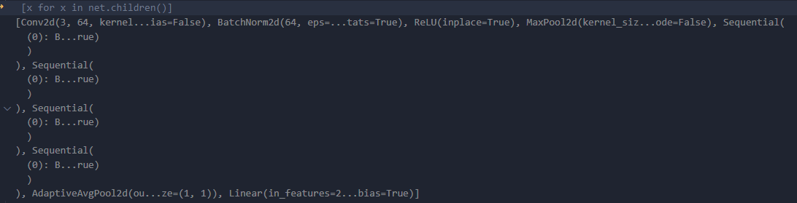
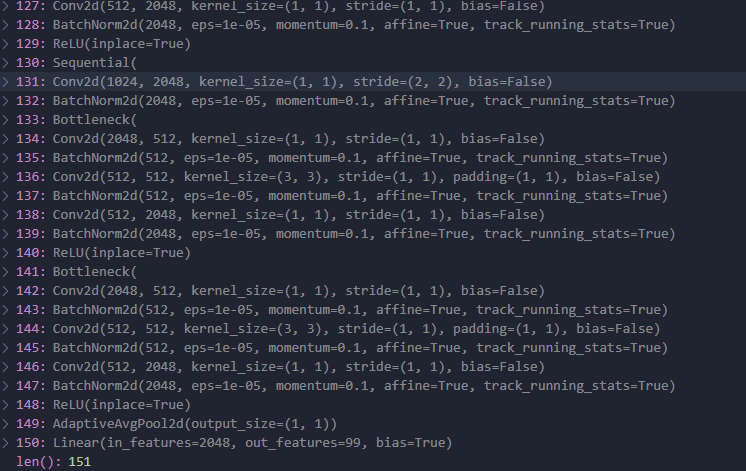
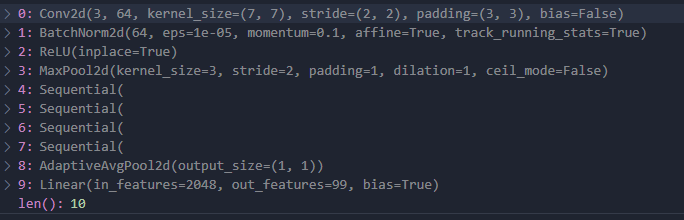
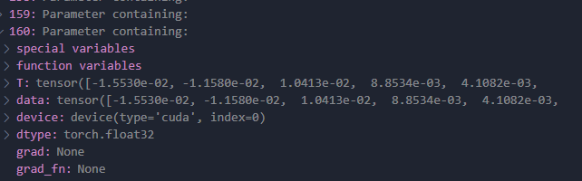
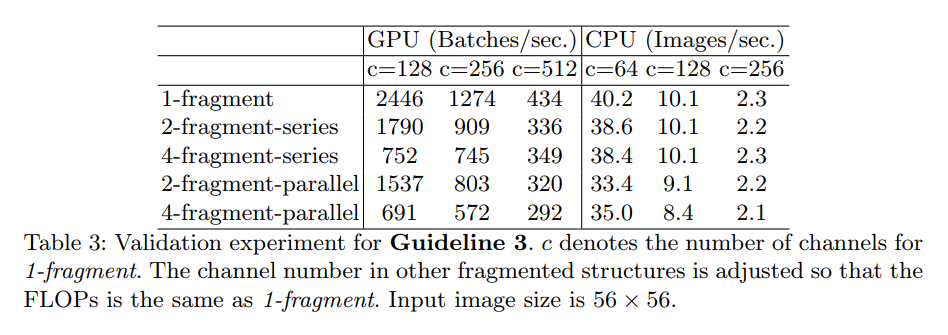
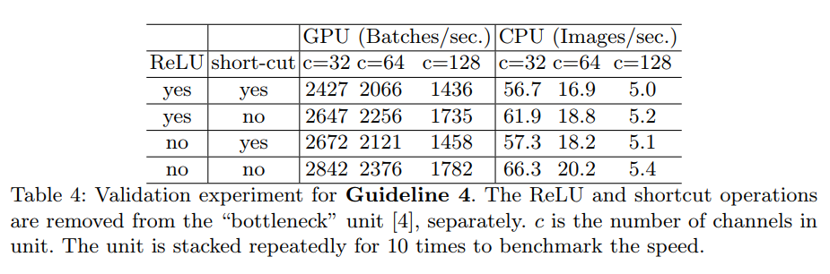

### 前言

在Pytorch中已经有封装好的函数来查看模型的结构、模型的参数，以及计算模型的参数量。下面我们来看看它们是如何实现的。

### param.numel()

在Pytorch中，统计模型的参数量可以使用param.numel()函数来实现。

```python
def get_parameter_number(model):
    total_num = sum(p.numel() for p in model.parameters())
    trainable_num = sum(p.numel() for p in model.parameters() if p.requires_grad)
    return {'Total': str(total_num / 1000 ** 2) + 'M', 'Trainable': str(trainable_num / 1000 ** 2) + 'M'}

print(get_parameter_number(net))
```

结果为：


### thop的profile

统计参数量也可以通过thop的profile来实现，除了Params之外还可以统计FLOPS。

```python
from thop import profile
from torchvision.models.resnet import resnet50
import torch

dummy_input = torch.rand(1, 3, 224, 224).cpu()
net = resnet50(num_classes=99, pretrained=False).cpu()
flops, params = profile(net, inputs=(dummy_input, ))
print("-" * 50)
print('FLOPS =' + str(flops / 1000 ** 3) + 'G')
print('Params =' + str(params / 1000 ** 2) + 'M')
```

结果为：


### Pytorch中查看模型结构、模型参数的函数

#### model.state_dict()
这个函数应该是我们最为熟知的，通过model.state_dict()返一个字典，然后将预训练模型的权重载入到模型结构中去。因为它本身就是一个字典，所以可以直接修改模型各层的参数，在参数剪枝上，使用起来特别方便。


#### model.modules()
这个函数会返回一个生成器，是一个可迭代的变量。通过model.modules()可以迭代地遍历模型的所有子层。


#### model.children()
model.children()只会遍历模型的子层，而不会迭代地进行遍历所有子层，而model.modules()能够迭代地遍历模型的所有子层。



这里做个对比：





可以看出，使用model.modules()会把所有的层都遍历出来，而model.children()只会遍历第一层子层。

#### model.parameters()
model.parameters()则是迭代地返回模型的所有参数。



#### model.named_modules()、model.named_children()和model.named_parameters()
顾名思义，它们就是带有名字的model.modules()、model.children()，model.parameters()。model.named_modules()、model.named_children()这两个函数不仅会返回模型的子层，还会带上这些层的名字。


model.named_parameters()就是迭代地返回带有名字的参数,会给每个参数加上带有.weight或者.bias的名字来区分是权重还是偏置。


### 参数量

在卷积神经网络中，一个卷积核的参数 = k x k x Cin + 1，其中1代表偏置。
一个卷积层的参数 = (一个卷积核的参数) x 卷积核的数目 = (k x k x Cin + 1) x Cout = k x k x Cin x Cout + Cout。

### FLOPS和FLOPs

- FLOPS：S是大写，代表floating point operations per second的缩写，指的是每秒浮点运算次数，可以理解为计算速度，是一个衡量硬件性能的指标。
- FLOPs：s是小写，代表floating point operations的缩写，其中s代表复数，指的是浮点运算数，可以理解为计算量，用来衡量模型的复杂度。
- 在大部分模型的加速和压缩对比加速效果中，所用的指标都是FLOPS，这个指标主要衡量的就是乘法和加法指令的数量。
- **但是它们几个之间并不是正向的关系，FLOPS并不能完全能够衡量模型的速度，以及模型的参数量少也不代表FLOPs低，并且理论的FLOPs低也不代表实际的推理速度快，因为还受计算平台、模型并行度等等的约束**。

### 浮点运算量和参数量的区别

- 浮点运算量是模型在实际推理过程时，加减乘除这些运算过程中的计算次数，描述的是计算力；
- 参数量指的是模型的大小，和输入的图片大小无关，描述的是所需要的内存；

### GFLOP

GFLOP其实是一个单位，1GLOPs=10亿次浮点运算，是学术界中论文里比较流行的单位。

### 高效设计网络的准则
不管是评估参数量还是计算量，目的都是为了评估这个网络是否具有高效性，在ShuffleNetV2论文中，提出了四条高效设计网络的准则。

#### 1.当卷积层的输入与输出的通道数相等时，内存访问时间MAC最小

假设一个1×1卷积层的输入特征图通道数是c1，输入特征图尺寸是h和w，输出特征通道数是c2，那么这样一个1×1卷积层的FLOPs就是：B=c1 x c2 x h x w x 1 x 1。


因为是1×1卷积，所以它的输入特征和输出特征尺寸是一样的，这里用h和w表示，其中h × w × c1表示输入特征所需的存储空间，h × w × c2表示输出特征所需的存储空间，c1 × c2表示卷积核所需的存储空间。

所以最终MAC = h × w (c1 + c2) + c1 × c2

根据均值不等式可以得出：


把MAC和B带入式子可得，当c1=c2，也就是当输入特征的通道数和输出特征的通道数相等时，在固定FLOPs时，MAC可以达到最小值。

#### 2.当组卷积中组group的数目增大时，MAC也会变大

带group操作的1×1卷积的FLOPs为B = h × w × c1 × c2 / g，g代表group数量。这是因为每个卷积核都只和c1 / g个输入通道的特征做卷积卷积运算，所以在式子中多除以了一个g。


同样MAC为h × w × (c1 + c2) + c1 × c2 / g，因此MAC和B之间的关系为MAC = h × w × (c1 + c2) + c1× c2 / g = h × w × c1 + B × g / c1 + B / (h × w)

这样可以看出，在固定B时，组卷积的g变大，MAC也会变大，因此，模型也会变慢。

#### 3.网络碎片化程度越高，速度越慢，即分支越多，模型越慢。

因为分支越多对并行计算越不利，在GPU上影响比较明显，而在ARM上的影响相对来说会小一些。



其中fragment为网络的支路数量。

#### 4.element-wise的影响不容小觑


FLOPS主要表示的是卷积层的时间消耗，而element-wise的操作虽然不怎么增加FLOPS，但element-wise如ReLU、shortcut等操作带来的影响不可忽视，这些操作所带来的时间消耗远比在FLOPS上体现的要高，因此要尽量减少element-wise操作。



### 文末

通过查看这些参数量、计算量这些数值，就可以对模型的大小、运行速度、占用资源有个大致的了解。对于参数量、计算量的统计，更多是作为是日常工具，而对于这一些日常使用的工具，我认为实践会比理论更加重要。